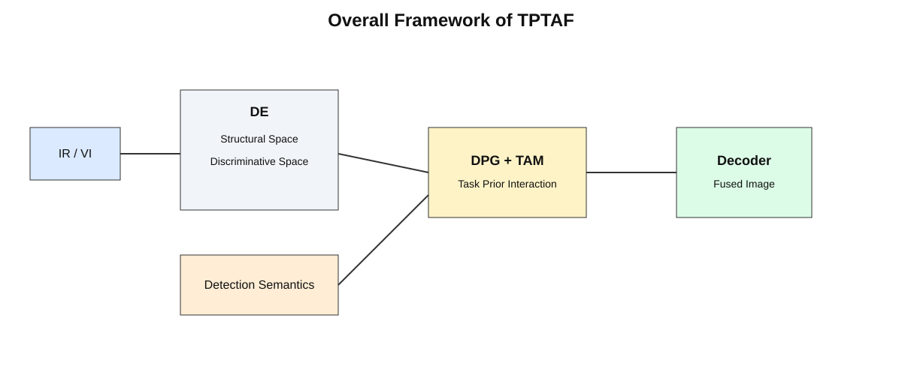

# TPTAF

**TPTAF: Task-Prior Tripartite Attention for Infrared and Visible Image Fusion**  
Xuyang Du, Xiwen Yao, Ankang Zang, and Gong Cheng  
**IEEE Transactions on Image Processing**, 2026  
[Paper](https://ieeexplore.ieee.org/document/11602761) · [DOI](https://doi.org/10.1109/TIP.2026.3709518) · [中文说明](README_zh.md)

## Introduction

Infrared images provide stable thermal cues under challenging illumination, while visible images preserve rich textures and scene structures. Existing fusion methods often use downstream supervision only through final predictions or global objectives, which gives limited control over the intermediate representation interaction where cross-modal structures and target-related details are selected.

TPTAF introduces **detection semantics as task-prior guidance for representation-level cross-modal interaction**. A Decoupled Encoder (DE) organizes each modality into structural and discriminative spaces. Detection-relevant semantics extracted from jointly encoded infrared-visible features are transformed into a task prior. The Tripartite Attention Module (TAM) coordinates structural constraints, discriminative details, and the detection prior so that target-related evidence directly regulates cross-modal feature selection. During joint training, Uncertainty-Weighted Learning (UWL) adaptively balances fusion and detection objectives.

## Overall framework

<p align="center">
  
</p>

TPTAF follows two parallel feature-extraction pathways:

1. **Unimodal feature decomposition:** DE constructs structural and discriminative spaces through PCSB and DDEB.
2. **Multimodal detection-semantic extraction:** shallow infrared-visible features are jointly encoded to obtain detection-relevant semantics.

The three representations are integrated by TAM for task-prior-guided interaction and then decoded into the fused image. UWL balances three fusion losses and three detection losses during joint optimization.

> The diagram above is a repository-native redraw of the paper framework for project documentation. Please refer to Fig. 1 in the paper for the publication figure.

## Highlights

- **Detection-prior-guided interaction:** detection semantics are transformed into task priors that directly guide intermediate cross-modal feature selection.
- **Structural-discriminative organization:** structural features constrain cross-modal layout consistency, while discriminative features retain complementary modality-specific details.
- **Uncertainty-weighted joint learning:** six fusion and detection losses are balanced adaptively without manually fixing all task weights.

## Release scope

This repository releases the **core TPTAF method implementation** and a complete protocol-oriented validation pipeline. It is not an end-to-end reproduction package for every number in the paper.

Included:

- DE, PCSB, DDEB, DPG, TAM, and the reconstruction network;
- TPTAF-owned detector preprocessing and external detector interface;
- the six-term UWL implementation;
- paired-data utilities, inference utilities, fusion metrics, detection metrics, and validation reporting;
- configuration and pseudocode documentation that separate paper-confirmed values from unresolved implementation details.

Not included:

- datasets or annotations;
- final trained checkpoints;
- the third-party detector source code or weights;
- the complete original training environment and unrecovered architecture-dependent settings.

Consequently, the repository can be used to inspect, test, and extend the released core implementation, but it does not claim exact end-to-end reproduction of the published tables without the original data, checkpoints, detector environment, and final experiment settings.

## Code map

| Paper component | Released code |
|---|---|
| Overall TPTAF network | `src/tptaf/model.py::TPTAF` |
| Decoupled Encoder (DE) | `src/tptaf/model.py::DecoupledEncoder` |
| Phase Coherent Structure Block (PCSB) | `src/tptaf/modules.py::PhaseCoherentStructureBlock` |
| Discriminative Detail Enhancement Block (DDEB) | `src/tptaf/modules.py::DiscriminativeDetailEnhancementBlock` |
| Detection preprocessing | `src/tptaf/detector.py::DetectionInputPreprocessor` |
| External detector contract | `src/tptaf/detector.py::DetectionSemanticsProvider` |
| Detection Prior Generator (DPG) | `src/tptaf/modules.py::DetectionPriorGenerator` |
| Tripartite Attention Module (TAM) | `src/tptaf/modules.py::TripartiteAttention` |
| Joint fusion-detection interface | `src/tptaf/joint.py::JointTPTAF` |
| Fusion losses and six-term UWL | `src/tptaf/losses.py` |
| Validation pipeline | `src/tptaf/validation.py`, `tools/val.py`, `val.py` |
| Fusion metrics | `src/tptaf/metrics.py` |
| Detection metrics | `src/tptaf/detection_metrics.py` |

## Installation

```bash
git clone https://github.com/Duxeno/TPTAF.git
cd TPTAF
python -m venv .venv
source .venv/bin/activate
pip install -r requirements.txt
```

On Windows PowerShell, activate the environment with:

```powershell
.venv\Scripts\Activate.ps1
```

## Basic model check

The detector implementation used in the paper is not redistributed. The core fusion network can be instantiated directly with a semantic feature tensor supplied by an external detector adapter:

```python
import torch

from src.tptaf.model import TPTAF

model = TPTAF(
    channels=64,
    detection_channels=64,
    num_heads=4,
    num_points=8,
    window_size=8,
)

infrared = torch.rand(1, 1, 256, 256)
visible = torch.rand(1, 1, 256, 256)
detection_semantics = torch.rand(1, 64, 32, 32)

output = model(infrared, visible, detection_semantics)
print(output.fused.shape)
```

The numerical values above are an executable example, not a claim that all architecture-dependent settings match the final experiment. See `docs/PARAMETER_STATUS.md` and `configs/tptaf_template.yaml`.

## Validation

The released validation pipeline evaluates **pre-generated fused images** against paired infrared and visible inputs. It includes:

- strict filename-based image pairing;
- SSIM, VIF, QAB/F, SCD, CC, and FMIdct;
- class-wise AP and mAP across IoU thresholds from 0.50 to 0.95 when a detection runner is provided programmatically;
- six-term UWL component and effective-weight reporting when a loss runner is provided;
- per-image CSV, per-class CSV, and JSON summaries.

Example for fusion-metric evaluation:

```bash
python tools/val.py \
  --fused-dir /path/to/fused \
  --data-root /path/to/dataset \
  --split val \
  --output-dir outputs/tptaf_validation
```

The expected dataset layout is documented in `data/README.md`. Metric values can differ slightly from the published tables when third-party metric implementations, image preprocessing, or detector settings differ from the original experiment.

## Paper evaluation scope

The paper evaluates fusion quality on **M3FD, RoadScene, AVMS, and MSRS**. **YOLOv8s** and **SegFormer-B1** are used for downstream object detection and semantic segmentation evaluation, respectively. Detection supervision provides the task prior during TPTAF training; semantic segmentation is used only as a downstream evaluation task.

## Parameter status

`configs/tptaf_template.yaml` records paper-confirmed settings and leaves unrecovered architecture-dependent values as `null`. Additional details are documented in:

- `docs/PARAMETER_STATUS.md`
- `docs/PSEUDOCODE.md`

This separation avoids presenting uncertain implementation choices as confirmed final settings.

## Repository structure

```text
TPTAF/
├── assets/tptaf_framework.svg
├── configs/tptaf_template.yaml
├── data/README.md
├── docs/
│   ├── PARAMETER_STATUS.md
│   └── PSEUDOCODE.md
├── src/tptaf/
│   ├── config.py
│   ├── data.py
│   ├── detection_metrics.py
│   ├── detector.py
│   ├── factory.py
│   ├── inference.py
│   ├── joint.py
│   ├── losses.py
│   ├── metrics.py
│   ├── model.py
│   ├── modules.py
│   └── validation.py
├── tools/val.py
├── val.py
├── CITATION.cff
├── LICENSE
├── LICENSE_NOTICE.md
├── README.md
├── README_zh.md
└── requirements.txt
```

## Citation

```bibtex
@article{du2026tptaf,
  author  = {Xuyang Du and Xiwen Yao and Ankang Zang and Gong Cheng},
  title   = {TPTAF: Task-Prior Tripartite Attention for Infrared and Visible Image Fusion},
  journal = {IEEE Transactions on Image Processing},
  year    = {2026},
  doi     = {10.1109/TIP.2026.3709518}
}
```

## License and third-party code

The original TPTAF code in this repository is released under the [MIT License](LICENSE). Third-party dependencies, datasets, detector implementations, and pretrained weights remain subject to their own licenses. See `LICENSE_NOTICE.md`.
