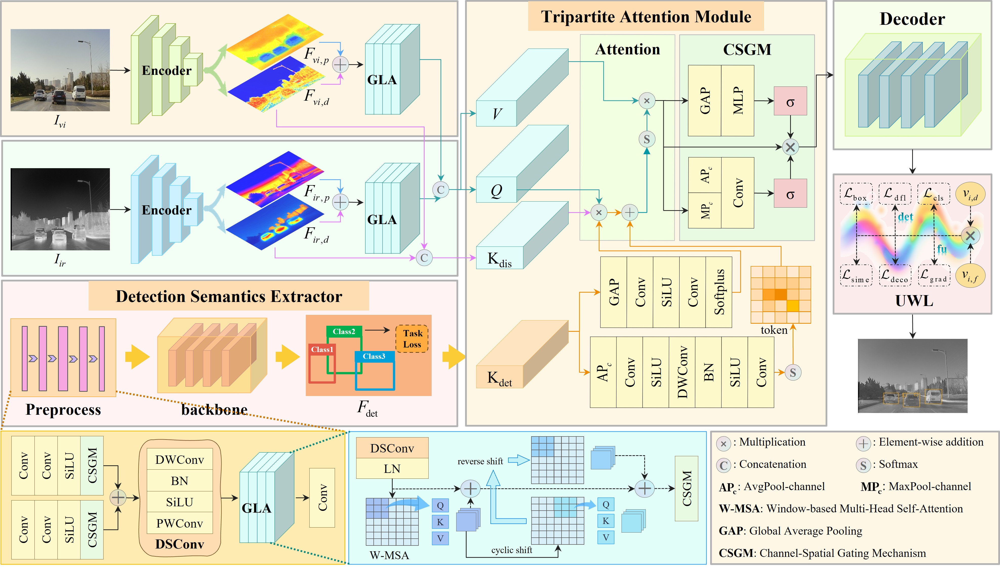

# TPTAF

**TPTAF: Task-Prior Tripartite Attention for Infrared and Visible Image Fusion**  
已被 **IEEE Transactions on Image Processing (TIP)** 接收，2026  
[论文](https://ieeexplore.ieee.org/document/11602761) · [DOI](https://doi.org/10.1109/TIP.2026.3709518) · [English](README.md)

## 论文简介

TPTAF 将检测语义作为任务先验，引导表示层面的红外—可见光特征交互。解耦编码器将每个模态组织到结构空间和判别空间；由红外—可见光混合特征提取的检测语义被转换为先验信息，并通过三元注意力模块（TAM）与解耦表示进行交互。联合训练过程中，不确定性加权学习（UWL）用于平衡三项融合损失和三项检测损失。

## 整体框架

<p align="center">
  
</p>

框架包含两条并行的特征提取路径：单模态特征分解和多模态检测语义提取。两条路径产生的表示由 TAM 进行检测先验引导的跨模态交互。

## 核心组成

- **解耦编码器（DE）**：构建结构特征空间与判别特征空间。
- **相位一致结构块（PCSB）**：从低频特征中保留与相位相关的结构组织。
- **判别细节增强块（DDEB）**：增强高频细节响应与局部对比度。
- **检测语义提取器**：从红外—可见光混合特征中形成检测相关语义。
- **检测先验生成器（DPG）**：为 TAM 提供温度、空间先验和稀疏采样参数。
- **三元注意力模块（TAM）**：协调结构约束、判别细节和检测先验信息。
- **不确定性加权学习（UWL）**：平衡 `L_sime`、`L_deco`、`L_grad`、`L_box`、`L_cls` 和 `L_dfl`。

## 发布代码

本仓库包含 TPTAF 的核心代码实现：

- PCSB、DDEB、GLA、DPG、TAM 与重建解码器；
- 检测输入预处理与外部检测器接口；
- 融合—检测联合数据流；
- 融合损失与六项 UWL；
- 配对数据和分块推理工具。

## 论文模块与代码对应

| 方法组成 | 代码 |
|---|---|
| TPTAF 主网络与 DE | `src/tptaf/model.py` |
| PCSB、DDEB、GLA、DPG 与 TAM | `src/tptaf/modules.py` |
| 检测预处理与检测器接口 | `src/tptaf/detector.py` |
| 融合—检测联合接口 | `src/tptaf/joint.py` |
| 融合损失与 UWL | `src/tptaf/losses.py` |
| 配对数据工具 | `src/tptaf/data.py` |
| 分块推理 | `src/tptaf/inference.py` |
| 概念数据流 | `docs/PSEUDOCODE.md` |

## 安装

```bash
git clone https://github.com/Duxeno/TPTAF.git
cd TPTAF
python -m venv .venv
source .venv/bin/activate
pip install -r requirements.txt
```

Windows PowerShell：

```powershell
.venv\Scripts\Activate.ps1
```

## 最小前向示例

```python
import torch
from src.tptaf.model import TPTAF

model = TPTAF()
infrared = torch.rand(1, 1, 256, 256)
visible = torch.rand(1, 1, 256, 256)
detection_semantics = torch.rand(1, 64, 32, 32)

output = model(infrared, visible, detection_semantics)
print(output.fused.shape)
```

## 论文评估设置

论文在 M3FD 上训练 TPTAF，并在 M3FD、RoadScene、AVMS 和 MSRS 上评估融合质量。YOLOv8s 和 SegFormer-B1 分别用于下游目标检测与语义分割评估。TPTAF 使用的检测语义来自检测监督，语义分割属于下游评估设置。

## 引用

```bibtex
@article{du2026tptaf,
  author  = {Xuyang Du and Xiwen Yao and Ankang Zang and Gong Cheng},
  title   = {TPTAF: Task-Prior Tripartite Attention for Infrared and Visible Image Fusion},
  journal = {IEEE Transactions on Image Processing},
  year    = {2026},
  doi     = {10.1109/TIP.2026.3709518}
}
```

## 许可证

本仓库中的 TPTAF 原创代码采用 [MIT License](LICENSE)。第三方资源说明见 `LICENSE_NOTICE.md`。
